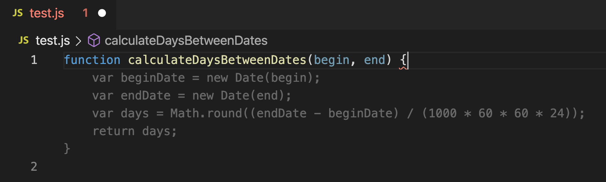
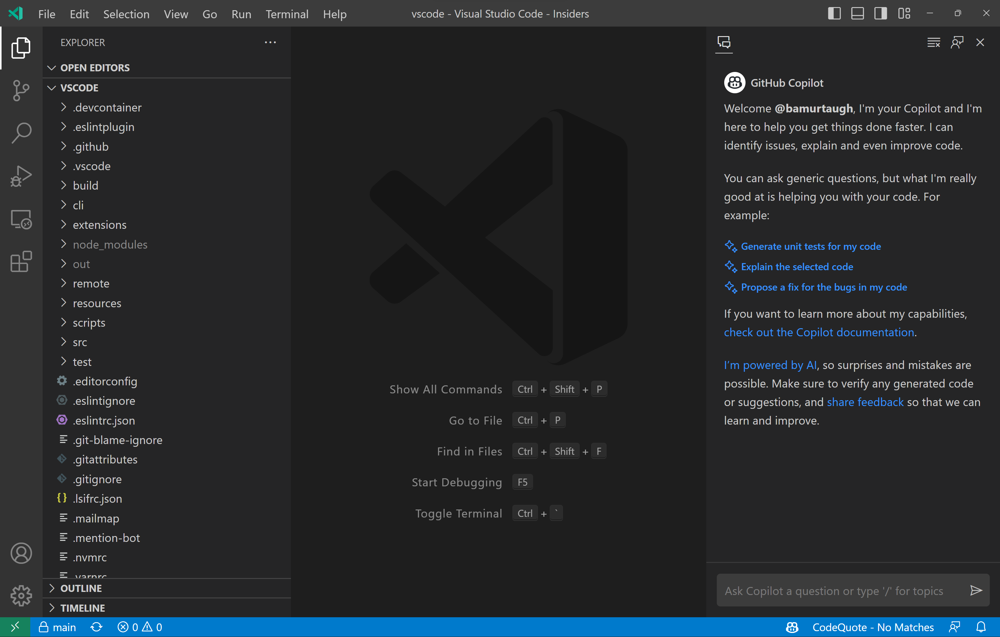
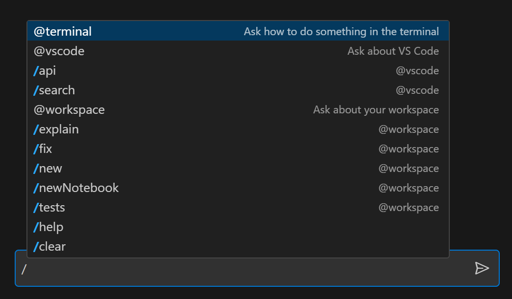

:notitle:
:customcss:

= De l'IA dans mon IDE

== C'est quoi l'IA

Un grand modèle de langage est un modèle de langage possédant un grand nombre de paramètres (généralement de l'ordre du milliard de poids ou plus).

[.notes]
--
Le LLM (Language Model) est utilisé pour la mise en oeuvre d'agent conversationnel
--

=== Comment ça marche

image::https://media.giphy.com/media/12NUbkX6p4xOO4/giphy.gif[Magic,480,440]

[.notes]
--
CF conf de quelqu'un d'autre
--

== On fait quoi avec ?

=== Complétion de code

=== Géneration de documentation

image::./generate-docs.png[]

=== Chatbot

=== Tips

== On essaye ?

Démo

